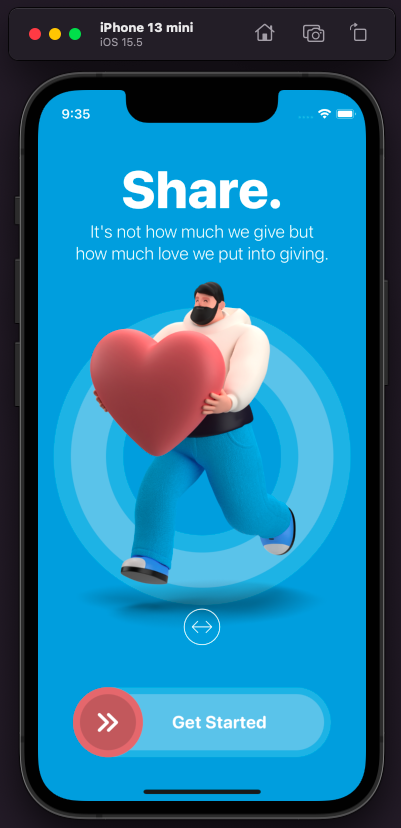
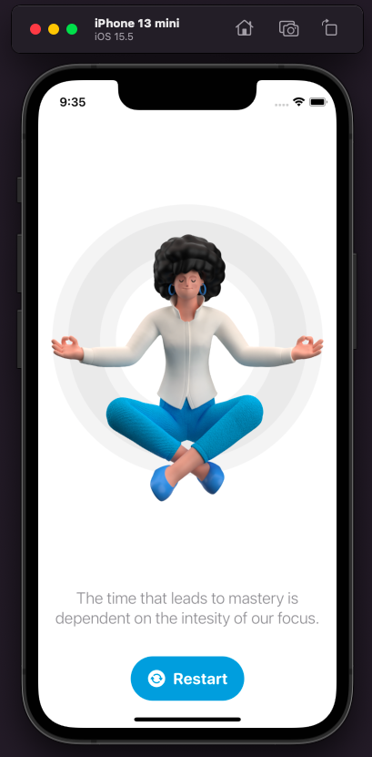

# Restart-App-SwiftUI

I made a few animations and designs using SwiftUI in this repository.

## Screenshots

 
 

App Video
--------------
https://user-images.githubusercontent.com/78587220/175803386-5c701fe5-7aa0-4007-8e3a-cdf1fdf03e9b.mp4
